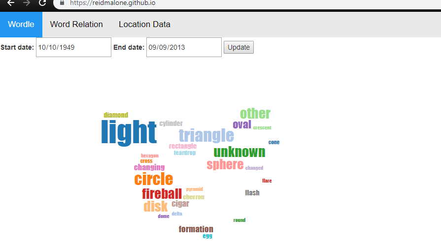
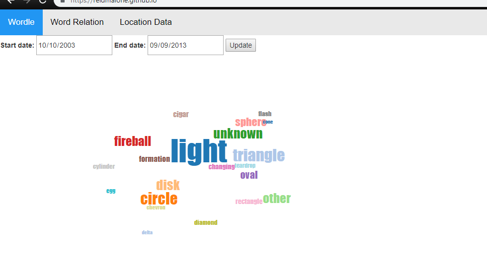
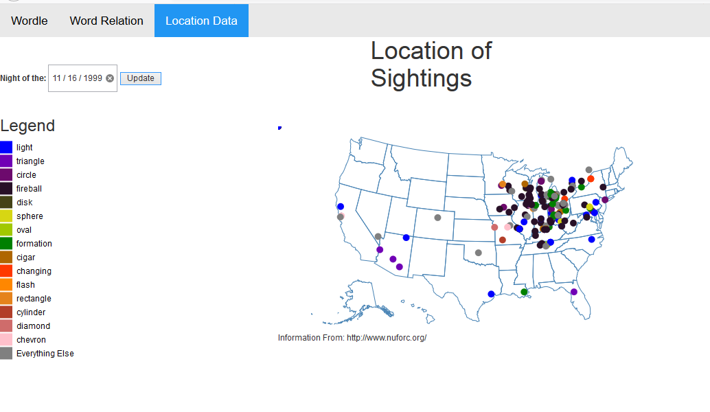
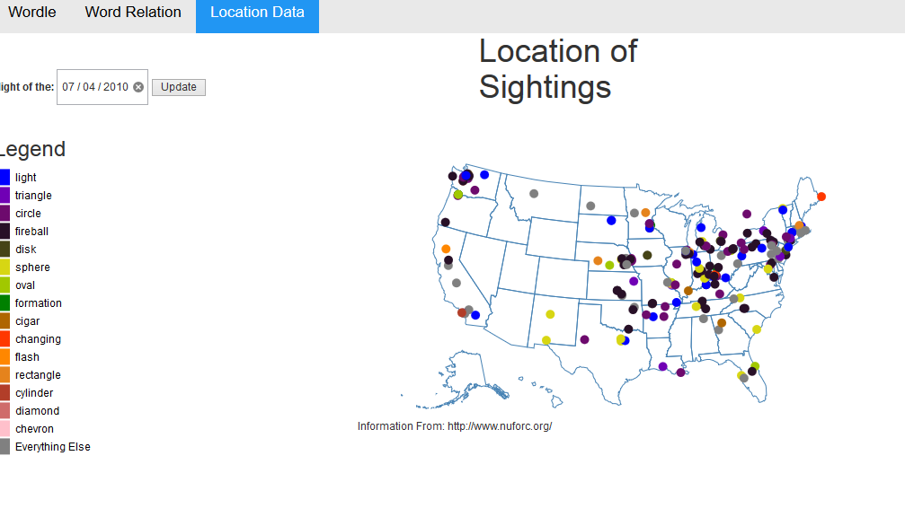
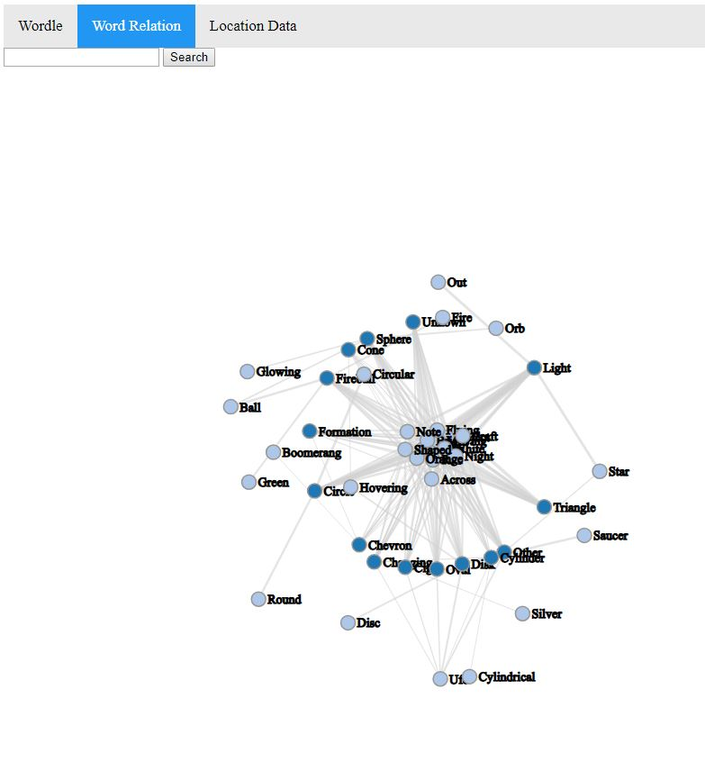

# Project 2 - UFO Visualization

Visualization Link: https://reidmalone.github.io/index.html

For our project we wanted to visualize UFO report data. We did this by making a word cloud, a relation diagram as well as a map relation. The dataset used was a pre-made .csv file obtained here: https://github.com/planetsig/ufo-reports. It was almost comical seeing the amount of reports on the 4th of July each year.

Reid Malone's contributions:

I was responsible for the word cloud. This takes in all of the data from a set range (which the user can set if they want) and displays
the top shape that was reported within the given time period. The word cloud works by setting the font size based upon how many occurances there were of that certain shape. The word cloud was inspired by and used a library from https://github.com/jasondavies/d3-cloud.

Something that I noticed is that "Light" was always the number one shape. As you can see below in the two different date ranges.

Victoria Huckabee's contributions:

I was responsible for the geo-location data. The logitude and latitude was ploted on a map of the the US using D3. Each color corresponds to a shape that was reported with the top 15 shapes having a unique color. The goal of this coloring was to be able to identify if people are seeing the same thing at night, this would be identifiable by seeing clusters of the same color dots on the map. You can also hover your mouse over one of the dots to see the shape, time and description associated with it. Finally, you can select the night that you want to view the data for from the top righthand selection. You can choose just one day at a time so that you won't be overwhelmed with data and can determine a trend for the night. Global trends for the geo-location data would not be very revealing for analysis.

The day with the second most reported was 11/16/1999 and when we look at that date we can see that a lot of the points are the same color and localized in the same area. We can conclude that some of these people might have been seeing the same thing. This can be visualized by the screenshot below:

This is in contrast to the day with the most sightings which is 7/4/2010. This is July 4th where people commonly shoot off fireworks so seeing unidentified objects in the sky might be because of that. There is also a rather large range of shapes that are reported and they are fairly spread out location wise as seen below:

Todd Robinson's contributions:

I designed the Force-Directed Relational Graph. I decided to find the relationship between the shapes of the UFO's reported, and the words used to describe each of them individually. The graph includes a search function to find any specific node, and hovering to display all first-order neighbors of any particular node. 

For my findings I saw that although there are several different shapes, each one had mostly the same terms used to describe them.

